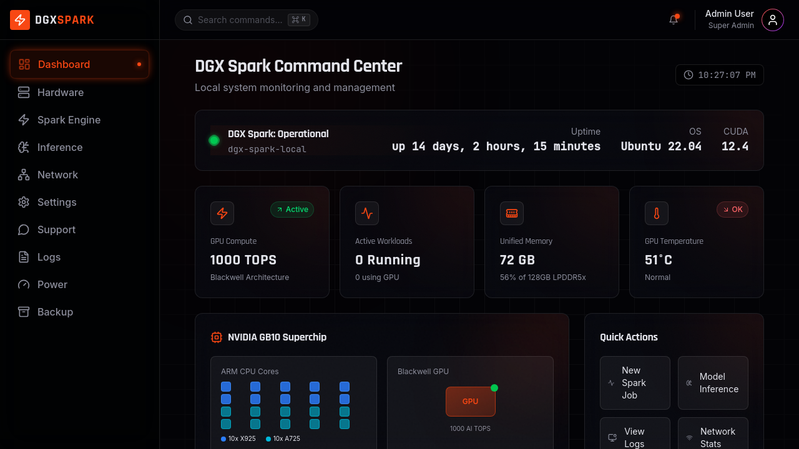

# DGX Spark Command Center

A highly technical interactive dashboard for monitoring and managing a cluster of 2 NVIDIA DGX Spark workstations. Built with React, TypeScript, tRPC, and real-time WebSocket updates.



## Features

### Real-Time Monitoring
- **GPU Metrics**: Temperature, utilization, memory usage, power consumption via WebSocket (2s intervals)
- **System Overview**: CPU, RAM, storage, and network statistics
- **Cluster Health**: Unified view of both DGX Spark nodes

### Hardware Management
- **NVIDIA GB10 Superchip**: Monitor ARM CPU cores (10x X925 + 10x A725) and Blackwell GPU
- **Power Management**: Adjust GPU power limits, fan speeds, and thermal profiles
- **Process Monitoring**: Track GPU processes and resource allocation

### Spark Engine Integration
- **Job Submission**: Submit and manage Apache Spark jobs with RAPIDS acceleration
- **Job History**: Track completed, running, and failed jobs
- **Resource Allocation**: Monitor executor and memory usage

### Model Inference
- **Inference Server**: Deploy and manage AI models
- **Performance Metrics**: Track throughput, latency, and GPU utilization
- **Model Management**: Load/unload models dynamically

### Network Monitoring
- **Interface Statistics**: Monitor all network interfaces
- **Traffic Analysis**: Real-time bandwidth and packet statistics
- **ExtraHop Integration**: Optional integration with ExtraHop for advanced network analytics

### System Administration
- **Logs Viewer**: Real-time log streaming with filtering by level and service
- **Backup/Restore**: Configuration backup and restore functionality
- **Alert Configuration**: Customizable alert thresholds and notifications

## Tech Stack

### Frontend
- **React 19** with TypeScript
- **Tailwind CSS 4** for styling
- **shadcn/ui** component library
- **Recharts** for data visualization
- **WebSocket** for real-time updates

### Backend
- **Node.js** with Express
- **tRPC** for type-safe APIs
- **Drizzle ORM** with PostgreSQL
- **WebSocket Server** for real-time metrics broadcasting

### Infrastructure
- **nvidia-smi** integration for GPU metrics
- **SSH** for multi-node management
- **Docker** support for containerized deployment

## Prerequisites

- Node.js 22+
- PostgreSQL 15+
- NVIDIA DGX Spark with CUDA drivers
- nvidia-smi available in PATH

## Installation

1. **Clone the repository**
   ```bash
   git clone https://github.com/cvalentine99/dgx-spark-command-center.git
   cd dgx-spark-command-center
   ```

2. **Install dependencies**
   ```bash
   pnpm install
   ```

3. **Configure environment variables**
   ```bash
   cp .env.example .env
   # Edit .env with your configuration
   ```

4. **Set up the database**
   ```bash
   pnpm db:push
   ```

5. **Start the development server**
   ```bash
   pnpm dev
   ```

6. **Access the dashboard**
   Open http://localhost:3000 in your browser

## Environment Variables

| Variable | Description | Default |
|----------|-------------|---------|
| `DATABASE_URL` | PostgreSQL connection string | Required |
| `JWT_SECRET` | Secret for JWT authentication | Required |
| `EXTRAHOP_API_URL` | ExtraHop appliance URL | Optional |
| `EXTRAHOP_API_KEY` | ExtraHop API key | Optional |

## Project Structure

```
dgx-spark-command-center/
├── client/                 # Frontend React application
│   ├── src/
│   │   ├── components/     # Reusable UI components
│   │   ├── contexts/       # React contexts (WebSocket, Auth)
│   │   ├── hooks/          # Custom React hooks
│   │   ├── lib/            # Utility functions
│   │   └── pages/          # Page components
│   └── public/             # Static assets
├── server/                 # Backend Node.js application
│   ├── routers/            # tRPC routers
│   ├── services/           # Business logic services
│   └── _core/              # Core server setup
├── shared/                 # Shared types and constants
│   ├── types.ts            # TypeScript type definitions
│   └── dgx-types.ts        # DGX-specific types
└── docs/                   # Documentation
```

## API Documentation

### tRPC Routers

| Router | Description |
|--------|-------------|
| `local` | Local system metrics and health |
| `spark` | Spark job management |
| `power` | GPU power and thermal management |
| `logs` | System log streaming |
| `config` | Configuration backup/restore |
| `metrics` | GPU metrics collection |
| `extrahop` | ExtraHop network integration |

### WebSocket Events

| Event | Direction | Description |
|-------|-----------|-------------|
| `gpu_metrics` | Server→Client | Real-time GPU metrics |
| `job_status` | Server→Client | Job state changes |
| `alert` | Server→Client | System alerts |

## Hardware Specifications

### NVIDIA DGX Spark
- **CPU**: 20-core ARM (10x Cortex-X925 + 10x Cortex-A725)
- **GPU**: NVIDIA Blackwell (1000 AI TOPS)
- **Memory**: 128GB Unified LPDDR5x
- **Storage**: NVMe SSD
- **Network**: 10GbE, USB4

## Development

### Running Tests
```bash
pnpm test
```

### Type Checking
```bash
pnpm typecheck
```

### Building for Production
```bash
pnpm build
```

## Deployment

### Docker Deployment
```bash
docker build -t dgx-spark-command-center .
docker run -p 3000:3000 dgx-spark-command-center
```

### Manual Deployment
```bash
pnpm build
pnpm start
```

## Security Considerations

- All sensitive operations require authentication
- Input validation on all API endpoints
- Command injection prevention for nvidia-smi calls
- SSH key-based authentication for multi-node management
- Rate limiting on API endpoints

## Contributing

1. Fork the repository
2. Create a feature branch (`git checkout -b feature/amazing-feature`)
3. Commit your changes (`git commit -m 'Add amazing feature'`)
4. Push to the branch (`git push origin feature/amazing-feature`)
5. Open a Pull Request

## License

This project is licensed under the MIT License - see the [LICENSE](LICENSE) file for details.

## Acknowledgments

- [NVIDIA DGX Spark Playbooks](https://github.com/NVIDIA/dgx-spark-playbooks)
- [NVIDIA DCGM](https://developer.nvidia.com/dcgm)
- [shadcn/ui](https://ui.shadcn.com/)
- [tRPC](https://trpc.io/)

## Support

For issues and feature requests, please use the [GitHub Issues](https://github.com/cvalentine99/dgx-spark-command-center/issues) page.
