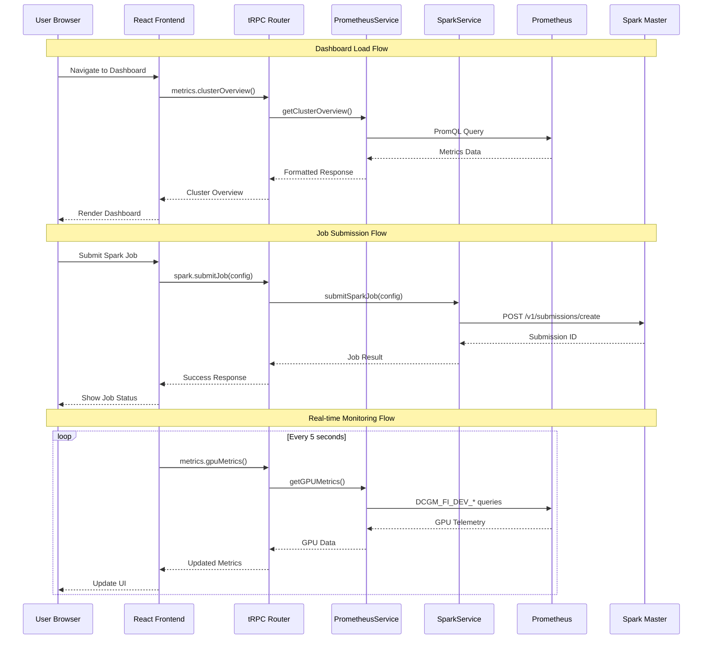
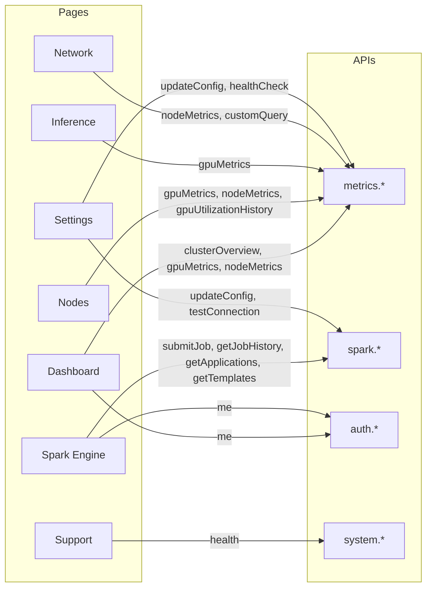

# DGX Spark Command Center - API Routes Diagram

## Overview

The DGX Spark Command Center uses **tRPC** for type-safe API communication between the React frontend and Node.js backend. All API routes are accessible via `/api/trpc/*`.

## Architecture Diagram

```mermaid
flowchart TB
    subgraph Frontend["Frontend (React)"]
        Dashboard["Dashboard Page"]
        Nodes["Nodes Page"]
        SparkEngine["Spark Engine Page"]
        Inference["Inference Page"]
        Network["Network Page"]
        Settings["Settings Page"]
        Support["Support Page"]
        JobDetails["Job Details Page"]
    end

    subgraph API["tRPC API Layer (/api/trpc)"]
        direction TB
        AppRouter["appRouter"]
        
        subgraph SystemRouter["system.*"]
            SysHealth["health"]
            SysNotify["notifyOwner"]
        end
        
        subgraph AuthRouter["auth.*"]
            AuthMe["me"]
            AuthLogout["logout"]
        end
        
        subgraph MetricsRouter["metrics.*"]
            MetHealth["healthCheck"]
            MetCluster["clusterOverview"]
            MetGPU["gpuMetrics"]
            MetNode["nodeMetrics"]
            MetGPUHist["gpuUtilizationHistory"]
            MetMemHist["memoryUsageHistory"]
            MetCustom["customQuery"]
            MetConfig["updateConfig"]
        end
        
        subgraph SparkRouter["spark.*"]
            SpkSubmit["submitJob"]
            SpkStatus["getJobStatus"]
            SpkKill["killJob"]
            SpkHistory["getJobHistory"]
            SpkApps["getApplications"]
            SpkAppDetails["getApplicationDetails"]
            SpkTest["testConnection"]
            SpkConfig["updateConfig"]
            SpkGetConfig["getConfig"]
            SpkTemplates["getTemplates"]
            SpkResources["getClusterResources"]
        end
    end

    subgraph Services["Backend Services"]
        PromService["PrometheusService"]
        SparkService["SparkService"]
    end

    subgraph External["External Systems"]
        Prometheus["Prometheus Server\n:9090"]
        SparkMaster["Spark Master\n:6066 (REST)\n:7077 (Submit)"]
        DCGM["DCGM Exporter\n:9400"]
        NodeExp["Node Exporter\n:9100"]
    end

    %% Frontend to API connections
    Dashboard --> MetCluster
    Dashboard --> MetGPU
    Dashboard --> MetNode
    
    Nodes --> MetGPU
    Nodes --> MetNode
    Nodes --> MetGPUHist
    
    SparkEngine --> SpkHistory
    SparkEngine --> SpkApps
    SparkEngine --> SpkSubmit
    SparkEngine --> SpkResources
    SparkEngine --> SpkTemplates
    
    JobDetails --> SpkStatus
    JobDetails --> SpkAppDetails
    JobDetails --> SpkKill
    
    Settings --> MetConfig
    Settings --> SpkConfig
    Settings --> MetHealth
    Settings --> SpkTest
    
    Network --> MetNode
    Network --> MetCustom

    %% API to Services
    MetricsRouter --> PromService
    SparkRouter --> SparkService

    %% Services to External
    PromService --> Prometheus
    SparkService --> SparkMaster
    Prometheus --> DCGM
    Prometheus --> NodeExp
```



## API Route Reference

### System Routes (`/api/trpc/system.*`)

| Route | Type | Auth | Description |
|-------|------|------|-------------|
| `system.health` | Query | Public | Health check endpoint |
| `system.notifyOwner` | Mutation | Admin | Send notification to system owner |

### Auth Routes (`/api/trpc/auth.*`)

| Route | Type | Auth | Description |
|-------|------|------|-------------|
| `auth.me` | Query | Public | Get current user info |
| `auth.logout` | Mutation | Public | Clear session and logout |

### Metrics Routes (`/api/trpc/metrics.*`)

| Route | Type | Auth | Input | Description |
|-------|------|------|-------|-------------|
| `metrics.healthCheck` | Query | Public | - | Check Prometheus connection status |
| `metrics.clusterOverview` | Query | Public | - | Get cluster-wide metrics summary |
| `metrics.gpuMetrics` | Query | Public | - | Get all GPU metrics (utilization, temp, power) |
| `metrics.nodeMetrics` | Query | Public | - | Get node-level system metrics |
| `metrics.gpuUtilizationHistory` | Query | Public | `{ hours: 1-168 }` | Get GPU utilization time series |
| `metrics.memoryUsageHistory` | Query | Public | `{ hours: 1-168 }` | Get memory usage time series |
| `metrics.customQuery` | Query | Public | `{ query: string }` | Execute custom PromQL query |
| `metrics.updateConfig` | Mutation | Public | `{ prometheusUrl: string }` | Update Prometheus endpoint |

### Spark Routes (`/api/trpc/spark.*`)

| Route | Type | Auth | Input | Description |
|-------|------|------|-------|-------------|
| `spark.submitJob` | Mutation | Public | `SparkJobConfig` | Submit a new Spark job |
| `spark.getJobStatus` | Query | Public | `{ submissionId }` | Get job status by ID |
| `spark.killJob` | Mutation | Public | `{ submissionId }` | Kill a running job |
| `spark.getJobHistory` | Query | Public | `{ limit, status }` | Get job history with filters |
| `spark.getApplications` | Query | Public | - | Get running Spark applications |
| `spark.getApplicationDetails` | Query | Public | `{ appId }` | Get detailed app info |
| `spark.testConnection` | Query | Public | - | Test Spark master connection |
| `spark.updateConfig` | Mutation | Public | `{ sparkMasterUrl }` | Update Spark master URL |
| `spark.getConfig` | Query | Public | - | Get current Spark config |
| `spark.getTemplates` | Query | Public | - | Get job templates |
| `spark.getClusterResources` | Query | Public | - | Get cluster resource usage |

## Data Flow Diagram



## SparkJobConfig Schema

```typescript
interface SparkJobConfig {
  appName: string;           // Application name (required)
  mainClass: string;         // Main class to execute (required)
  appResource: string;       // Path to JAR/Python file (required)
  appArgs?: string[];        // Application arguments
  executorMemory: string;    // e.g., "8g" (default)
  executorCores: number;     // 1-20 (default: 4)
  numExecutors: number;      // 1-10 (default: 2)
  driverMemory: string;      // e.g., "4g" (default)
  driverCores: number;       // 1-8 (default: 2)
  enableRapids: boolean;     // Enable RAPIDS GPU acceleration (default: true)
  rapidsPoolSize: string;    // GPU memory pool size (default: "2G")
  sparkProperties?: Record<string, string>; // Additional Spark properties
}
```

## Page-to-API Mapping



## External Endpoints

### Prometheus Queries Used

| Metric | PromQL Query | Used By |
|--------|-------------|---------|
| GPU Utilization | `DCGM_FI_DEV_GPU_UTIL` | Dashboard, Nodes |
| GPU Temperature | `DCGM_FI_DEV_GPU_TEMP` | Nodes |
| GPU Memory Used | `DCGM_FI_DEV_FB_USED` | Dashboard, Nodes |
| GPU Power Draw | `DCGM_FI_DEV_POWER_USAGE` | Nodes |
| CPU Usage | `100 - (avg(irate(node_cpu_seconds_total{mode="idle"}[5m])) * 100)` | Dashboard |
| Memory Usage | `node_memory_MemTotal_bytes - node_memory_MemAvailable_bytes` | Dashboard |
| Network I/O | `rate(node_network_receive_bytes_total[5m])` | Network |

### Spark REST API Endpoints

| Endpoint | Method | Description |
|----------|--------|-------------|
| `/v1/submissions/create` | POST | Submit new job |
| `/v1/submissions/status/{id}` | GET | Get job status |
| `/v1/submissions/kill/{id}` | POST | Kill running job |
| `/api/v1/applications` | GET | List applications |
| `/api/v1/applications/{id}` | GET | Application details |
